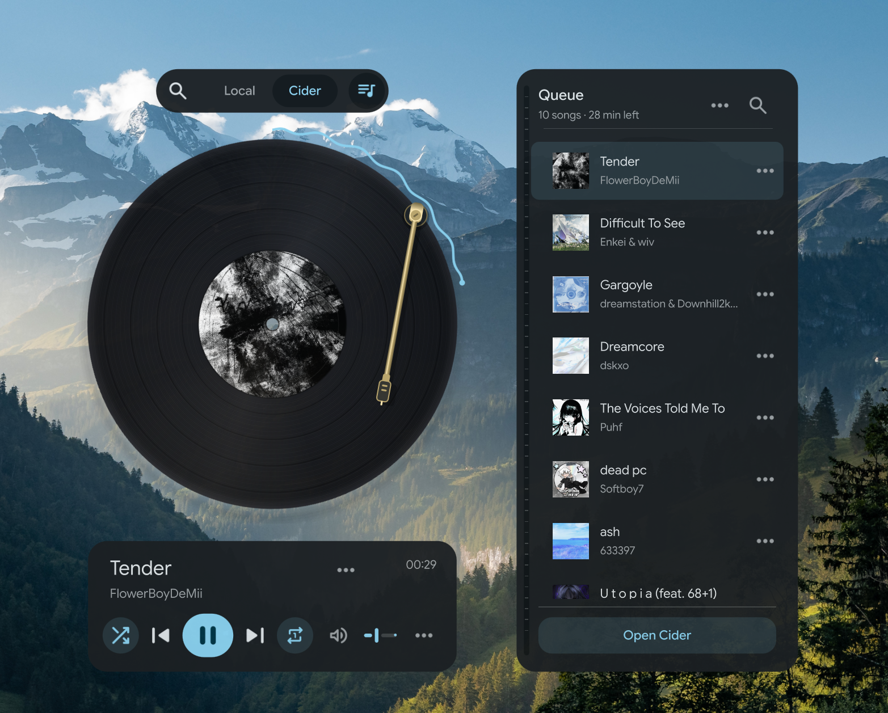

<h1 align="center">Spun</h1>

<p align="center">A CD-shaped music player for Linux.</p>

<p align="center">
  
</p>

<p align="center">
  <a href="https://buymeacoffee.com/E_Gurl">
    
  </a>
  <br>
  <sub>Optional support for Spun's development.</sub>
</p>

<p align="center">
  <a href="#install-on-cachyos-or-arch-linux">Install</a> ·
  <a href="#start-listening">Get started</a> ·
  <a href="#inside-the-player">Features</a> ·
  <a href="#troubleshooting-and-privacy">Help</a> ·
  <a href="#license">License</a>
</p>

Play local music, or control Apple Music through Cider. Your album artwork becomes the disc, with a quiet interface inspired by Material Design 3 and colors that follow Noctalia. Browse songs, albums and playlists, search your library, and manage the queue without constantly switching apps.

**Source-available · PolyForm Noncommercial 1.0.0.** Free for the purposes allowed by the license, including personal and noncommercial use. This is not an OSI-approved open-source project. [Read the license details](#license).

## Install on CachyOS or Arch Linux

Spun currently builds from source; there is no packaged installer yet. Open a terminal and run:

```bash
sudo pacman -S --needed base-devel git cmake ninja python qt6-base qt6-declarative qt6-multimedia qt6-svg taglib

git clone https://github.com/yappologistic/Spun.git
cd Spun
./scripts/build.sh -DBUILD_TESTING=OFF
./scripts/install-launcher.sh
```

Open **Spun** from your application menu, or run `./scripts/run.sh` from the Spun folder. Keep that folder where it is: the launcher points to it. If you move it, run `./scripts/install-launcher.sh` again from its new location.

<details>
<summary>Building on another Linux distribution</summary>

Other Linux distributions need a C++20 compiler, CMake 3.22+, Ninja, pkg-config, Python 3, Qt 6.8+ with Quick Controls, Multimedia, SVG and development files, and TagLib 2.0+ development files. Package names differ between distributions. Spun is developed on CachyOS with Hyprland and Noctalia; desktop integration can vary elsewhere.

</details>

## Start listening

**Local music:** choose **Local**, then **+** to add tracks. You can also drop audio files or a folder onto Spun. Folder imports include the audio files directly inside that folder. Your music files are not modified. **More → Play demo** plays the included original soundcheck.

**Apple Music through Cider:** open Cider, sign in there, and choose **Cider** in Spun. Cider still handles authentication and streaming and must remain running. Apple Music playback requires the appropriate Apple Music access through Cider.

For search, library browsing and the full queue:

1. Enable Cider's local API.
2. In Cider, open **Settings → Connectivity → Manage External Application Access** and create an application token for Spun. Allow the access needed for playback, queue and library features.
3. Open Spun's **Queue** and enter the token when prompted.

Spun connects to Cider's local API on port 10767. Basic playback controls use Linux's media-player interface; working playback alone does not mean the API connection is ready. Available library and playback actions depend on your Cider version and its permissions.

## Inside the player

- **Queue:** use the top-right button to view tracks with artwork, search, reorder or remove them.
- **Browse:** in Cider mode, use the top-left search button for Apple Music search, your library and recently played tracks. Albums and playlists open to their track lists, with search inside each collection.
- **Track actions:** use a song's **⋯** menu to play next or add it to the queue. Supported Cider actions also include favorites and saving songs to your library. Writing songs into playlists is not currently supported.
- **Music links:** paste an Apple Music song, album or playlist link into search, or drop it on the player. Spun shows the result before you choose playback.
- **Disc reverse:** double-click the disc or press **F** to see album details and tracks. Switch to lyrics with **Y** when available. Local lyrics can come from matching `.lrc` / `.txt` files or embedded metadata.
- **Mini mode:** a little CD with controls underneath. Optionally keep it above other windows in Preferences.

**More → Preferences** contains the font picker, background blur, disc animation and other playback options. Spun follows Noctalia's colors and reduced-motion preference when available. Hyprland integration depends on the compositor's supported interfaces.

### Fonts

Spun uses your system font by default. Choose any installed family in **More → Preferences → Font**, or return to **System default**. Fonts are not bundled or downloaded automatically.

For the intended appearance, we recommend [Google Sans Flex](https://github.com/googlefonts/googlesans-flex/releases). Download the font from its official releases, install the TTF with your desktop's font installer, reopen Spun, and select it in Preferences. The font has its own [SIL Open Font License](https://github.com/googlefonts/googlesans-flex/blob/main/OFL.txt); keep the accompanying license with your font files.

<details>
<summary><strong>Keyboard shortcuts</strong></summary>

| Action | Shortcut |
| --- | --- |
| Play / pause | Space |
| Previous / next track | Ctrl + Left / Right |
| Seek backward / forward | Left / Right |
| Add files / folder | Ctrl + O / Ctrl + Shift + O |
| Queue | Ctrl + L |
| Cider browser | Ctrl + B |
| Search the current panel | Ctrl + F |
| Mini mode | Ctrl + M |
| Flip disc / switch lyrics | F / Y |
| Mute | M |
| Keyboard help | F1 |
| Back / dismiss | Escape |
| Quit | Ctrl + Q |

</details>

## Update or remove

To update, open a terminal in your Spun folder:

```bash
git pull --ff-only
./scripts/build.sh -DBUILD_TESTING=OFF
```

To remove the application-menu entry:

```bash
rm "${XDG_DATA_HOME:-$HOME/.local/share}/applications/spun.desktop"
```

You can then delete the Spun source folder. Your music stays where it was. Preferences remain in `~/.config/spun/` unless you choose to remove them separately.

## Troubleshooting and privacy

**Cider plays, but search or the queue fails:** check that Cider is running, its local API is enabled, and Spun's application token is valid with the required permissions. A playback connection and an API connection are separate.

**A font is missing:** install it on your system, reopen Spun and select it in Preferences. An unavailable saved font falls back to your system font.

**An audio file will not play:** supported formats depend on the codecs available to Qt Multimedia on your distribution.

Spun does not ask for your Apple Music password. The Cider application token is stored locally with owner-only file permissions in `~/.config/spun/cider-connection.json`; preferences live in `~/.config/spun/settings.ini`. Artwork and music metadata may be fetched as part of playback and browsing. Do not share your token, private configuration, listening history or personal logs in issue reports.

This repository contains source code, license notices, UI icons, an original synthesized demo with generated cover art, and the approved project screenshot above. Private account configuration, logs and other desktop captures are excluded.

## Development

<details>
<summary>Build, test and benchmark</summary>

Build the diagnostic companion and run isolated playback, API-fixture and UI checks:

```bash
./scripts/build.sh -DBUILD_TESTING=ON
QT_QPA_PLATFORM=offscreen QT_QUICK_BACKEND=software QSG_RENDER_LOOP=basic QT_QPA_PLATFORMTHEME= ./build/spun --self-test
```

The tests use temporary preferences and synthetic local API fixtures. Audio checks need a working user audio session, and API fixtures need permission to listen on loopback. The normal player is built separately from the diagnostic executable.

For controlled performance measurements, run `python3 scripts/benchmark.py --output /tmp/spun-performance`. Its isolated scenes do not connect to your Cider instance. Offscreen measurements are useful comparisons, not whole-desktop GPU measurements. Regenerate the original soundcheck with `python3 scripts/make-demo.py` after building; this additionally requires FFmpeg.

</details>

Bug reports are welcome. Before submitting substantial code contributions, open an issue to discuss scope and contributor licensing. Any future commercial distribution needs appropriate rights to contributed code as well as compliance with third-party licenses; submitting a patch does not transfer its copyright.

## License

Spun's original code and assets are offered under the [PolyForm Noncommercial License 1.0.0](LICENSE), with the [required notice and third-party credits](NOTICE).

The license permits noncommercial use, specified personal uses, modification and redistribution under its terms. It also expressly permits use by certain charitable, educational, public research, public safety, health, environmental and government institutions, regardless of funding. It is therefore broader than “personal use only.” Uses outside its permissions require a separate license from the relevant rights holder. The full license controls.

This licensing choice allows the author to offer separate commercial terms for code they own in the future. No paid edition is being offered here.

Material Symbols Rounded icons remain under their own [Apache 2.0 license](licenses/MaterialSymbols-LICENSE.txt). Qt, TagLib and optional fonts retain their respective licenses; Spun's noncommercial terms do not replace those licenses. Spun is an independent project and is not endorsed by Google, Apple, Cider or Noctalia.
